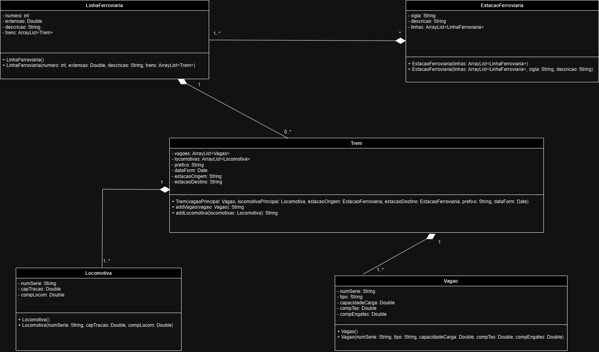

# Train Station Project

## Main Purpose

- Implement knowledge about modeling using UML.

## Project Overview (PT/BR)

- OOP work on modelling a train station.

### Unified Modeling Language (UML)

## Team 

- Hiel Saraiva Freitas de Queiroga.
- Conrado Einstein Malessa de Oliveira.

## Versions:

- Java 21
